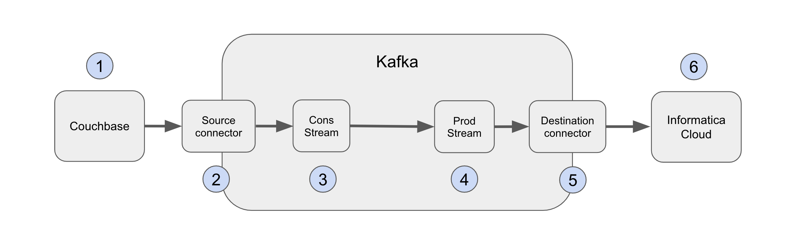

[](https://shields.io/)
[](https://GitHub.com/Naereen/StrapDown.js/graphs/commit-activity)


# Couchbase Kafka Connector and Confluent platform

## Confluent and Couchbase Kafka Connector installation

### Set up Confluent platform
docker-compose.yml is provided by 
```
git clone https://github.com/confluentinc/cp-all-in-one.git
```
Go to confluent directory. In the service named connect add or update the version of couchbase kafka connector in command part : ```confluent-hub install --no-prompt couchbase/kafka-connect-couchbase:4.2.3```. Replace the version with the current one.
```
connect:
    image: cnfldemos/cp-server-connect-datagen:0.6.2-7.5.0
    hostname: connect
    container_name: connect
    depends_on:
      - broker
      - schema-registry
    ports:
      - "8083:8083"
    environment:
      CONNECT_BOOTSTRAP_SERVERS: 'broker:29092'
      CONNECT_REST_ADVERTISED_HOST_NAME: connect
      CONNECT_GROUP_ID: compose-connect-group
      CONNECT_CONFIG_STORAGE_TOPIC: docker-connect-configs
      CONNECT_CONFIG_STORAGE_REPLICATION_FACTOR: 1
      CONNECT_OFFSET_FLUSH_INTERVAL_MS: 10000
      CONNECT_OFFSET_STORAGE_TOPIC: docker-connect-offsets
      CONNECT_OFFSET_STORAGE_REPLICATION_FACTOR: 1
      CONNECT_STATUS_STORAGE_TOPIC: docker-connect-status
      CONNECT_STATUS_STORAGE_REPLICATION_FACTOR: 1
      CONNECT_KEY_CONVERTER: org.apache.kafka.connect.storage.StringConverter
      CONNECT_VALUE_CONVERTER: io.confluent.connect.avro.AvroConverter
      CONNECT_VALUE_CONVERTER_SCHEMA_REGISTRY_URL: http://schema-registry:8081
      # CLASSPATH required due to CC-2422
      CLASSPATH: /usr/share/java/monitoring-interceptors/monitoring-interceptors-7.5.0.jar
      CONNECT_PRODUCER_INTERCEPTOR_CLASSES: "io.confluent.monitoring.clients.interceptor.MonitoringProducerInterceptor"
      CONNECT_CONSUMER_INTERCEPTOR_CLASSES: "io.confluent.monitoring.clients.interceptor.MonitoringConsumerInterceptor"
      CONNECT_PLUGIN_PATH: "/usr/share/java,/usr/share/confluent-hub-components"
      CONNECT_LOG4J_LOGGERS: org.apache.zookeeper=ERROR,org.I0Itec.zkclient=ERROR,org.reflections=ERROR
    command: >
      bash -c "
      confluent-hub install --no-prompt couchbase/kafka-connect-couchbase:4.2.3;
      /etc/confluent/docker/run;
      sleep infinity;
      "
```
Simply exec
```
cd confluent
docker-compose up -d
```

Check the installation with
```
curl -X GET http://localhost:8083/connector-plugins | jq
```
You should see :
```
[
  {
    "class": "com.couchbase.connect.kafka.CouchbaseSinkConnector",
    "type": "sink",
    "version": "4.2.3"
  },
  {
    "class": "com.couchbase.connect.kafka.CouchbaseSourceConnector",
    "type": "source",
    "version": "4.2.3"
  },
  {
    "class": "io.confluent.kafka.connect.datagen.DatagenConnector",
    "type": "source",
    "version": "null"
  },
  {
    "class": "org.apache.kafka.connect.mirror.MirrorCheckpointConnector",
    "type": "source",
    "version": "7.5.0-ce"
  },
  {
    "class": "org.apache.kafka.connect.mirror.MirrorHeartbeatConnector",
    "type": "source",
    "version": "7.5.0-ce"
  },
  {
    "class": "org.apache.kafka.connect.mirror.MirrorSourceConnector",
    "type": "source",
    "version": "7.5.0-ce"
  }
]
```
### Create data in Couchbase
Create a bucket named mat-sample and restore data from the dump. We use cbbackupmgr tool to perform this.

### Configure Couchbase Kafka Connector
We use the source configuration connector

```
{
  "name": "CouchbaseSourceConnector",
  "config": {
    "name": "CouchbaseSourceConnector",
    "connector.class": "com.couchbase.connect.kafka.CouchbaseSourceConnector",
    "tasks.max": "1",
    "key.converter": "org.apache.kafka.connect.storage.StringConverter",
    "value.converter": "org.apache.kafka.connect.converters.ByteArrayConverter",
    "couchbase.seed.nodes": "ec2-13-36-243-80.eu-west-3.compute.amazonaws.com",
    "couchbase.username": "admin",
    "couchbase.bucket": "mat-sample",
    "couchbase.password": "******",
    "couchbase.source.handler": "com.couchbase.connect.kafka.handler.source.RawJsonWithMetadataSourceHandler",
    "couchbase.stream.from": "BEGINNING",
    "couchbase.scope": "contrats"
  }
}
```

Note that we use 
 ```"couchbase.source.handler": "com.couchbase.connect.kafka.handler.source.RawJsonWithMetadataSourceHandler"```

A topic per collection will be created. You can sent this configuration with curl. 
```
cd confluent
curl -X POST -H "Content-Type: application/json" -d @couchbaseSourceConnector.json http://localhost:8083/connectors
```

The message in the topic looks like : 
```
{
  "bucket": "mat-sample",
  "partition": 105,
  "cas": "1725284754851037184",
  "revSeqno": 16,
  "lockTime": 0,
  "bySeqno": 23,
  "vBucketUuid": 188595540357020,
  "flags": 33554438,
  "expiration": 0,
  "event": "mutation",
  "key": "095e7ddd61b8::29d0d9a5-d8a1-4dac-8530-2ed8bb5f9c4f",
  "content": {
    "id": "29d0d9a5-d8a1-4dac-8530-2ed8bb5f9c4f",
    "numSocietaire": "095e7ddd61b8",
    "datePremierEffet": "2020-04-05T16:32:00",
    "situationsRefs": [
      {
        "id": "4935b4f9-63fa-4cb7-8282-b21b6521bf61",
        "datePremierEffet": "2020-04-18T16:32:00"
      },
      {
        "id": "ee59de1d-a6a9-412b-aa83-c90c0d9b2603",
        "datePremierEffet": "2022-02-18T16:32:00"
      },
      {
        "id": "0c7a128f-903f-4077-89f2-f91dddb8c13b",
        "datePremierEffet": "2024-08-18T16:32:00"
      }
    ]
  }
}
```

## Use case #1 : Create a Domain Event when a data is mutated in Couchbase

### Architecture



1 - A document from a specific collection is produced or modified.  
2 - The couchbase Kafka source connector captures the document and publish it into a topic dedicated for the specific collection  
3 - A consumer Stream listens to the topic, creates a domain event and sends it to a Producer Stream  
4 - The producer Stream sends the domain event to a destination topic which is listened by Informatica Cloud Sink connector  
5 - The Informatica Cloud Sink Connector sends the message to Informatica Cloud  

### Consumer Stream

Firstly, we create a stream to consume data as it. So map desired attributes in the first STREAM

In order to visualize all previous messages we need to configure parameter ```auto.offset.reset=Earliest``` before creating the stream and exec a ksql request.

#### Step 1 - Create a Stream to get raw data
```
CREATE STREAM contrats_stream (
  id STRING KEY,
  event STRING,
  content STRUCT<
    id STRING,
    numSocietaire STRING,
    datePremierEffet STRING,
    situationsRefs ARRAY<STRUCT<
      id STRING,
      datePremierEffet STRING
    >>
  >
) WITH (
    KAFKA_TOPIC='mat-sample.contrats.contrats',
    VALUE_FORMAT='JSON'
);
```

Note that TIMESTAMP Type in Kafka doesn't exist so you can use BIGINT Type to benefit from Time function with KSQL. Here I use STRING Type to simplify.

#### Step 2 - Create a table to follow updates

```
CREATE TABLE contrats_table AS
SELECT
    id,
    latest_by_offset(event) AS latest_event,
    latest_by_offset(content->datePremierEffet) AS latest_datePremierEffet
FROM contrats_stream
GROUP BY id;
```

#### Step 3 - Create a Stream to detect changes

```
CREATE STREAM contrats_changes AS
SELECT
    c1.id,
    c1.content->datePremierEffet AS new_datePremierEffet,
    c2.latest_datePremierEffet AS old_datePremierEffet
FROM contrats_stream c1
LEFT JOIN contrats_table c2
ON c1.id = c2.id
WHERE c1.content->datePremierEffet != c2.latest_datePremierEffet
EMIT CHANGES;
```

#### Troubleshots


If you want to replay all events already sore in the topic :  
1 - Verify your messages are still in the topic  
```
kafka-console-consumer --bootstrap-server localhost:9092 --topic mat-sample.contrats.contrats --from-beginning
```

2 - Control the offset of your topic :
```
kafka-consumer-groups --bootstrap-server localhost:9092 --describe --group _confluent-controlcenter-7-5-0-lastProduceTimeConsumer
```

3 - If necessarry, reset the offset
```
kafka-consumer-groups --bootstrap-server localhost:9092 --group _confluent-controlcenter-7-5-0-lastProduceTimeConsumer --topic mat-sample.contrats.contrats --reset-offsets --to-earliest --execute
```

 you can use ```kafka-console-consumer``` available in kafka-server or cp-server

### Transform data to a Domain Event


## Create a STREAM

```
CREATE STREAM contrats_stream (
  id STRING KEY,
  numSocietaire STRING,
  datePremierEffet STRING,
  situationsRefs ARRAY<STRUCT<
    id STRING,
    datePremierEffet STRING
  >>
) WITH (
    KAFKA_TOPIC='mat-sample.contrats.contrats',
    VALUE_FORMAT='JSON'
);
```

```
CREATE TABLE contrats_table AS
SELECT id,
       numSocietaire,
       datePremierEffet,
       situationsRefs,
       COUNT(*) AS total_count
FROM contrats_stream
GROUP BY id, numSocietaire,datePremierEffet,situationsRefs;
```

## Explore data with TABLE

To better explore data than the usage of 
```
PRINT 'my_topic' FROM BEGINNING;
```
We can setup Kafka TABLE that maintain a state of the data sent, but this table can't handle PULL Ksql Requests, so it can't be queryable. 
This table is used for handling PUSH Ksql Requests.
Anyway we create it and derive it to a queryable one.

```
CREATE TABLE contrats_table(
  id STRING PRIMARY KEY,
  numSocietaire STRING,
  datePremierEffet TIMESTAMP,
  situationsRefs ARRAY<STRUCT<
    id STRING,
    datePremierEffet TIMESTAMP
  >>
)WITH(
  KAFKA_TOPIC = 'mat-sample.contrats.contrats',
  VALUE_FORMAT = 'JSON'
);
```

Then create derived table 
```
CREATE TABLE QUERYABLE_CONTRATS_TABLE AS 
SELECT * FROM  CONTRATS_TABLE;
```

